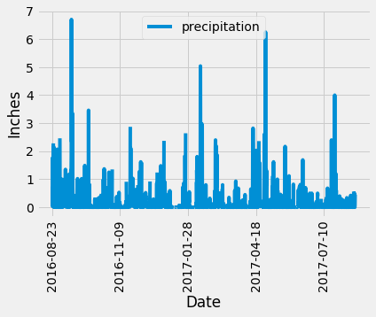
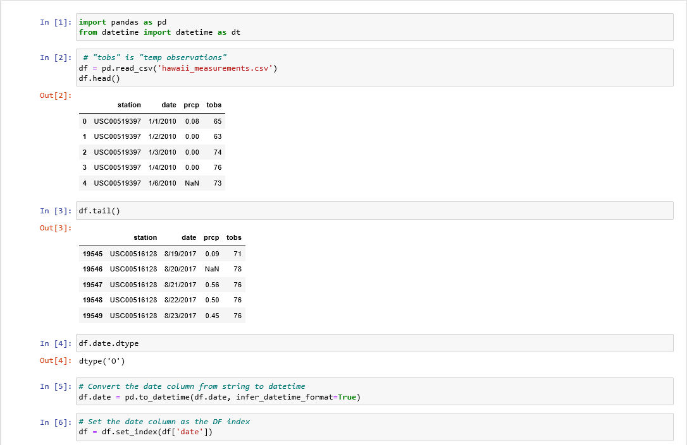
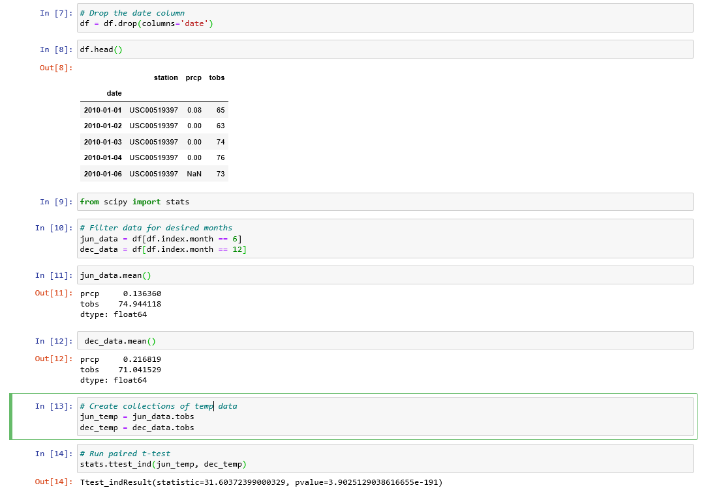

# surfs-up

# Summary #
* *Overview,*
* *Climate Analysis and Exploration*
* *Climate App*
* *Bonus*
* *Technology used*

# Overview #
You've decided to treat yourself to a long holiday vacation in Honolulu, Hawaii! To help with your trip planning, you need to do some climate analysis on the area. The following outlines what you need to do.

# Climate Analysis and Exploration #

## Precipitation Analysis ##
* Design a query to retrieve the last 12 months of precipitation data.
* Select only the date and prcp values.
* Load the query results into a Pandas DataFrame and set the index to the date column.
* Sort the DataFrame values by date.
* Plot the results using the DataFrame plot method.

## Station Analysis ##
* Design a query to calculate the total number of stations.
* Design a query to find the most active stations.
* List the stations and observation counts in descending order.
* Which station has the highest number of observations?
* Hint: You will need to use a function such as func.min, func.max, func.avg, and func.count in your queries.
* Design a query to retrieve the last 12 months of temperature observation data (TOBS).
* Filter by the station with the highest number of observations.
* Plot the results as a histogram with bins=12.

# Climate App #
Now that you have completed your initial analysis, design a Flask API based on the queries that you have just developed.
Use Flask to create your routes.

* /api/v1.0/precipitation
Convert the query results to a dictionary using date as the key and prcp as the value.
Return the JSON representation of your dictionary.

* /api/v1.0/stations
Return a JSON list of stations from the dataset.

* /api/v1.0/tobs
Query the dates and temperature observations of the most active station for the last year of data.
Return a JSON list of temperature observations (TOBS) for the previous year.

* /api/v1.0/<start> and /api/v1.0/<start>/<end>

# Bonus #
## Temperature Analysis 1 ##
Here is the coding:

## Analysis ##
The difference of the mean temperature between June and December during the period of time is 3.9 degrees Celsius. I did use an unpaired t-test with a very low p-value, which has a difference we can consider very significant statistically spoken.

## Temperature Analysis 2 ##
* The starter notebook contains a function called calc_temps that will accept a start date and end date in the format %Y-%m-%d. The function will return the minimum, average, and maximum temperatures for that range of dates.
* Use the calc_temps function to calculate the min, avg, and max temperatures for your trip using the matching dates from the previous year (i.e., use "2017-01-01" if your trip start date was "2018-01-01").
* Plot the min, avg, and max temperature from your previous query as a bar chart.

## Daily Rainfall Average ##
* Calculate the rainfall per weather station using the previous year's matching dates.
* Calculate the daily normals. Normals are the averages for the min, avg, and max temperatures.
* You are provided with a function called daily_normals that will calculate the daily normals for a specific date. This date string will be in the format %m-%d. Be sure to use all historic TOBS that match that date string.
* Create a list of dates for your trip in the format %m-%d. Use the daily_normals function to calculate the normals for each date string and append the results to a list.
* Load the list of daily normals into a Pandas DataFrame and set the index equal to the date.
* Use Pandas to plot an area plot (stacked=False) for the daily normals.
  

# Technology Used #
* Flask
* API
* Jsonify
* %m-%d
* Panda
* fun.min/max/avg/count
* .cvs files
* sqlite files
  
## Authors ##
Sylvain David - Data Analytics Bootcamp - Vanderbilt University - 2020
